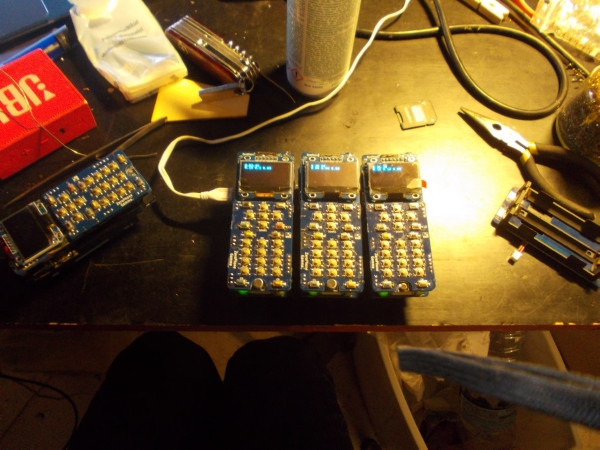
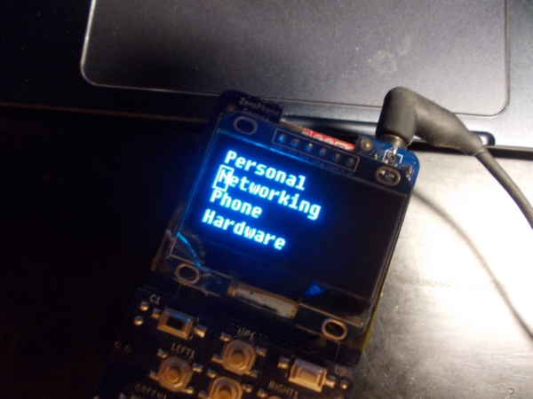
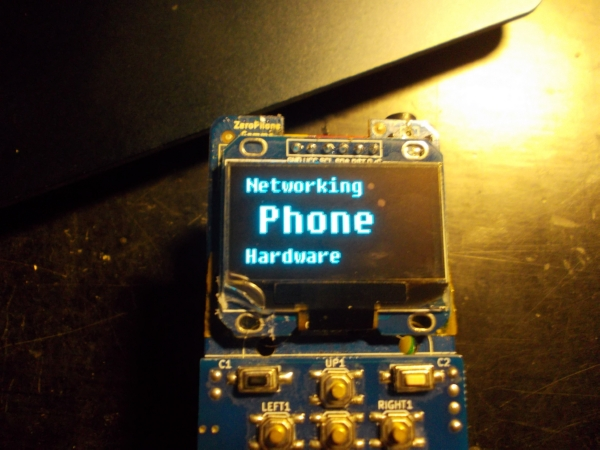
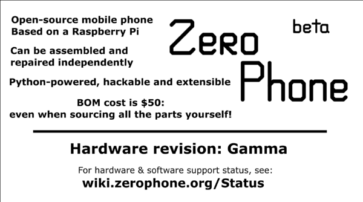
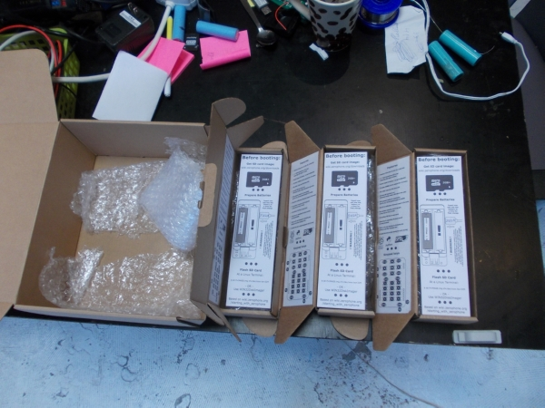

# Building&testing phones, UI facelift and leaflets

   
 Hello and welcome to our "once a week but I really need to get better at this" ZeroPhone news installment! This week, I'm finally sending ZeroPhones to Hackaday - for Hackaday Prize Best Product finals. Speaking of that...  
   
---

## Project state

   
 [Here's a Hackaday worklog about project state](https://hackaday.io/project/19035/log/68849), what follows is a tl;dr with some sneak peek photos =)  
   
 Hackaday Prize deadline is 21st of October - there are about 6 days for me to send out 3 phones to Hackaday, finish BOM for this version, make assembly instructions, a small (2-5min.) video, a couple of apps... That's intense, but this is why I like deadlines. Meeting this deadline makes ZeroPhone eligible to win one of the 6 prizes in Hackaday Prize finale, so there's no lack of motivation.   
   
   
   
 Here are the 3 phones that I just assembled for Hackaday, in about 7 hours' time - not from zero, of course, all SMD components and some THT components were already soldered on - I had to solder on the USB ports, the Pi Zero, the displays and then make some finishing touches. While assembling all this, I got even more fixes/additions/ideas for the next revision (ZeroPhone Delta), hoping to make it as complete as possible - and I'm going to build at least 10-15 of those, too! I've also described my thoughts on [what parts of ZeroPhone need to be tested after assembly](https://hackaday.io/project/19035/log/68840) =)  
   
   
   
 The UI is getting a facelift. It's happening with configurability in mind, too! Now, you can write your own "view" objects for UI elements, and those views fully control how the UI element is displayed. So, if you feel like having a phone with a menu styled just like your old phone does - it's possible! Here I am, playing with Sony-Ericsson menu style:  
   
   
   
     
 What about non-UI things? Well, I've made a[ "ZeroPhone assembly checklist" wiki page](http://wiki.zerophone.org/index.php/ZeroPhone_assembly_checklist), both for myself and others who will be assembling ZeroPhones. It has the most tricky&non-obvious steps that have to be made during assembly - most of them are going to be phased out on the next revisions. This is the first step towards having decent assembly instructions, and it's also yet another useful page on the Wiki - I'm quite happy about it!  
   
   
   
   
 [Morning.Star](https://hackaday.io/Jez.Boxall), one of project's active contributors, designed leaflets that go into ZeroPhone shipping box. We have a 1) sticker for outside of the box, [with logo and revision name](https://cdn.hackaday.io/images/original//5351031507878988266.png) 2) a sticker for the inside of the box, [with feature list and keypad key disambiguation](https://cdn.hackaday.io/images/original//5215211507846707596.png) 3) a leaflet [(front side)](https://cdn.hackaday.io/images/original//6249261507867399674.png) [(back side)](https://cdn.hackaday.io/images/original//5253361507867534535.png) with instructions for starting with ZeroPhone, essentially, repeating [the Wiki page](http://wiki.zerophone.org/index.php/Starting_with_ZeroPhone), but more concisely. The leaflet files are also open-source, [and on GitHub!](https://github.com/ZeroPhone/leaflets/)  
   
   
   
 Could you please [follow ZeroPhone on Twitter](https://twitter.com/ZeroPhoneOSHW)? I'm going to make a simple Twitter app in the next few days, at least that's my plan - this is one of the apps that's long overdue, and will make for a nice in-depth tutorial on making ZeroPhone apps!  
   
 Also, I've made [a Liberapay account!](https://liberapay.com/zerophone/) Not sure if I should make a Patreon - can't think of any kind content for me to share with patrons, I probably need to think it through more.  
   
---

## P.S.

 If you have any suggestions, comments, project ideas or wishes - you can [fill out the survey](https://zerophone.github.io/newsletter/survey/), reply to this e-mail, reach me on [Hackaday](https://hackaday.io/CRImier) or [Reddit](https://www.reddit.com/user/CRImier), maybe comment on [the Hackaday project](https://hackaday.io/project/19035) - whatever works for you! 

  