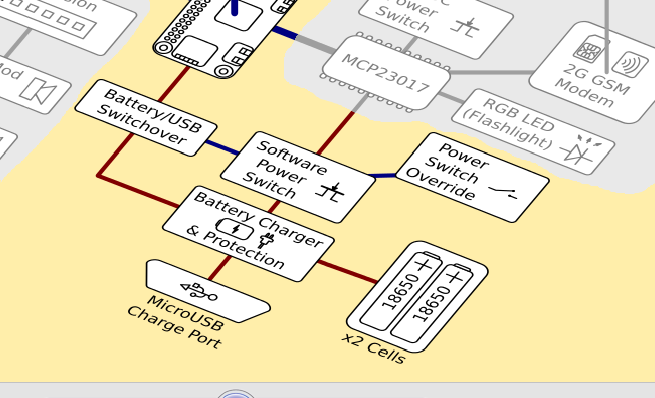
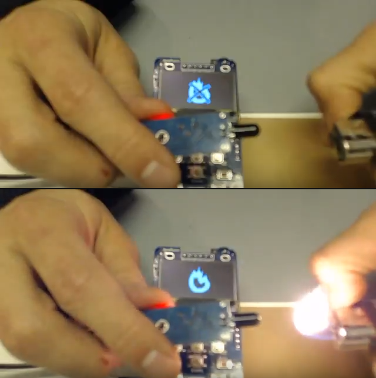

# Hackaday Prize, documentation, tutorials and Pi Zero hacks
  
Sorry for the late newsletter - I was planning to release one right after Hackaday Prize finals deadline, but got entangled in personal problems, and now I'm sorting out some health issues. Nevertheless, I'm back here for a newsletter, and it's time to tell you about pre-Hackaday Prize progress! I'm working on a big (not Prize-related) worklog right now, as well as [sourcing instructions](http://wiki.zerophone.org/index.php/Sourcing_ZeroPhone_parts), so I'll have material for one more newsletter to be released ASAP =)  
   
  
   
I've decided to finally start sharing my "tons of Pi Zero-related hacks" that I had in the project description for over half a year =D Here's the first one - [on powering the Pi Zero directly from a LiIon battery](https://hackaday.io/project/19035/log/70211) (without a step-up). It's a great approach for many battery-powered projects that need as much battery life as possible, and don't actually need 5V.  
   
The way ZeroPhone is powered required me to make some unconventional decisions. [Here's a big writeup](https://hackaday.io/project/19035/log/69388) on why 18650 is the default battery type for ZeroPhone. Does it mean you can't use pouch cells? Of course, not =) I'm going to look for online shops that provide suitable pouch cells (both by capacity and dimensions) in USA and Europe - any suggestions?  
   
  
   
While preparing the Hackaday Prize video, I made a small proof-of-concept app that'd monitor an external flame sensor and show a picture whenever it'd detect flames. [Here's the code](https://github.com/ZeroPhone/ZPUI/blob/prettier_ui/apps/example_apps/fire_detector/main.py) - it's very simple. Here's also [an in-depth tutorial on that app](https://hackaday.io/project/19035/log/70211) - as the code is short, I decided to tell more about it, and I spent lots of time talking about how to properly initialize resources that your app might need - as well as added some useful features&helpers to ZPUI. Again, props to [@Morning.Star](https://hackaday.io/Jez.Boxall) for drawing the pictures, a couple of hours before the Prize deadline =)  
   
I made [a video for Hackaday Prize](https://www.youtube.com/watch?v=Rja6Z74btI8)! It's not professional quality by any means, and was done in a rush (I uploaded it 2 minutes before the deadline), but you still might like it. The only problem I have with this video is that the first app pictured (programming an ATMega2560) had to pretty much be a mockup, since I still don't have enough OLED breakouts with CS pin available ([so I couldn't use SPI on the expansion slot](https://hackaday.io/project/19035/log/63250)). Other than that, I liked making it, and I'd like to think I did the best I could in this timeframe =D  
   
There's now [a documentation site for ZPUI](http://zpui.readthedocs.io/en/latest/) - ZeroPhone UI framework! I changed the name from pyLCI, which is actually [the parent project of the ZPUI](https://hackaday.io/project/10001), but now ZPUI and pyLCI have two different directions and I want to make sure they are easy to distinguish. I'll be moving some pages from ZeroPhone Wiki to ZPUI documentation pages, too, so that location of the pages makes sense (and updating the Wiki to replace all pyLCI mentions with ZPUI, too). Slowly but surely, I'll be bringing the documentation to actual state - if anybody is willing to help with it, [here's the easiest way to start.](https://github.com/ZeroPhone/ZPUI/issues/15)  
   
See you in a week or so! I'm now working on [the component sourcing instructions](http://wiki.zerophone.org/index.php/Sourcing_ZeroPhone_parts). Also, I'm working on a large worklog, I hope you will like it - and I'll make a "Project state" worklog to go with it, too =) Other than that, it seems like it's finally time to finish drawing the Delta boards and the accompanying mod boards (including 3G) - there are lots of minor but important changes to be done to the boards before they will be good enough to make a new release, which will be used for a new batch of ZeroPhones!  
   
---

## P.S.

If you have any suggestions, comments, project ideas or wishes - you can [fill out the survey](https://zerophone.github.io/newsletter/survey/), reply to this e-mail, reach me on [Hackaday](https://hackaday.io/CRImier) or [Reddit](https://www.reddit.com/user/CRImier), maybe comment on [the Hackaday project](https://hackaday.io/project/19035) - whatever works for you! Also, consider supporting me on[ Liberapay](https://liberapay.com/zerophone/), or [donating on PayPal](https://www.paypal.me/TheZeroPhone)!
   
If you're new to this project, absolutely do [check out ZeroPhone Wiki](http://wiki.zerophone.org), as well as [newsletter archives](https://zerophone.github.io/newsletter/) - and don't forget about [the Hackaday.io page](https://hackaday.io/project/19035)!

  
