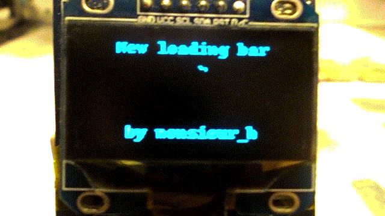
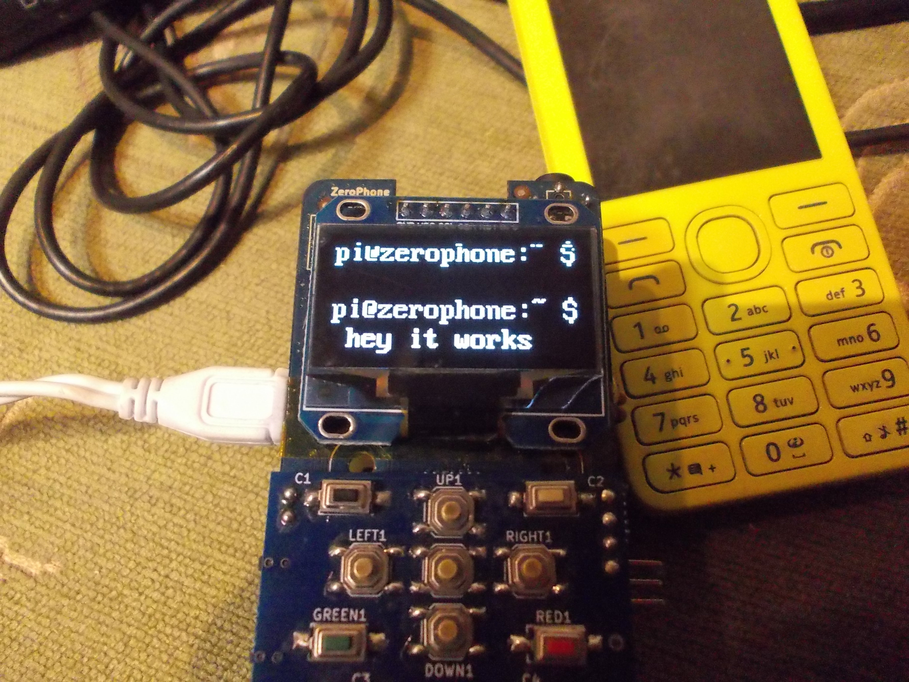
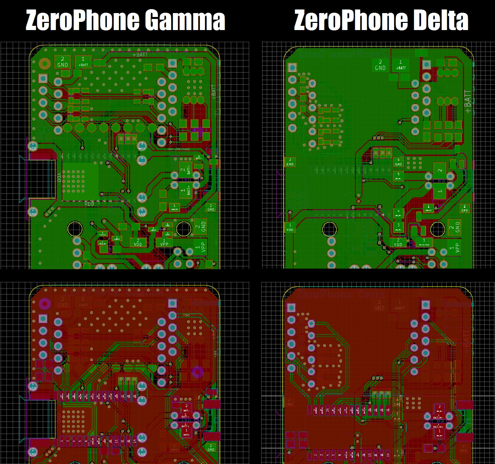
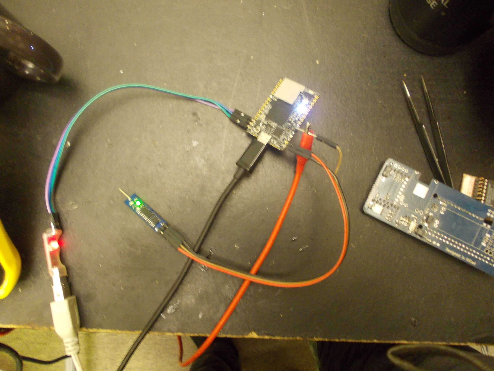
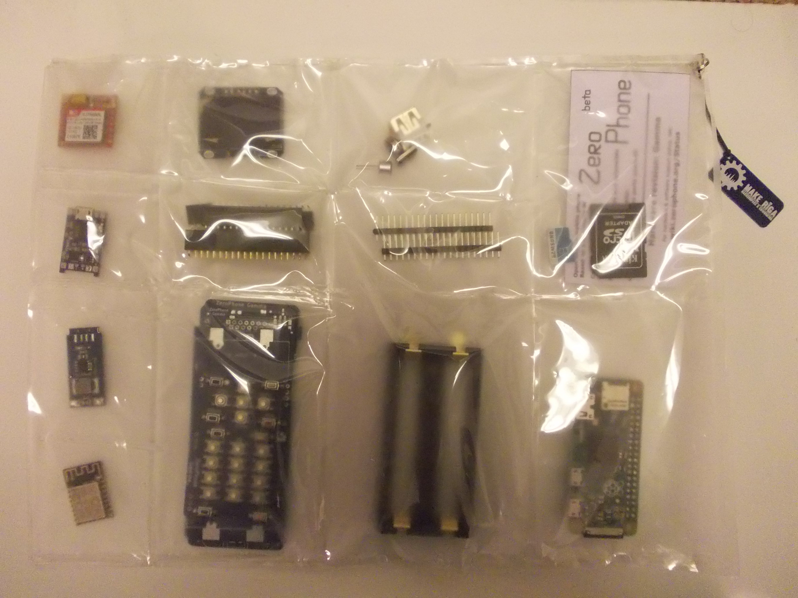

# Sourcing guidelines, Delta boards and new contributors

 First of all, sorry for such a long radio silence. This has been such an eventful time period, I found it hard to find a couple of days to compile a full newsletter - will be looking for a way to make it easier for me. Title photo shows one of  of the experiments that I finally got the chance to work on during this period, I'll see if there's a way to make this into a reliable and well-supported addon (potentially, have an option of replacing the interface with this) - though it's a long road ahead, undoubtedly. Speaking about long roads - [here's a worklog](https://hackaday.io/project/19035/log/93792) that tells you about some of the hardware-related challenges I've encountered during this year!  
   
 [The sourcing guidelines are finished!](https://wiki.zerophone.org/index.php/Sourcing_ZeroPhone_parts) That means - there's now a guide for ordering ZeroPhone parts, which you can actually use right now. I've put a lot of work into the guidelines, trying to decrease chances of somebody accidentally buying the wrong parts, wasting both time and money. A project's contributor, [blitzaxt](https://github.com/blitzaxt), is also working on a script that generates a PDF checklist, so that you can print it out and easily go through the list, making sure you don't forget to order some important thing! There's also [a simplified list of components](https://hackaday.io/project/19035/components) published, in case you just want a quick reference on what's inside. Once [the assembly instructions](https://hackaday.io/project/19035/instructions) are finished (currently still WIP), ZeroPhone will finally properly fullfill one of its promises - "a phone that you can assemble independently"!  
   
   
 It's even prettier in real life :-)  
   
 We've got new contributors! They've been making ZeroPhone better, each in their own way - for example, I've already mentioned blitzaxt's work. [monsieur\_h](https://github.com/monsieurh) has joined the project in November, and has since helped with fixing and improving the ZPUI (and other ZeroPhone-related) code, raising many important questions and and providing valuable input on the way. Among all things, he's researching and working on ofono integration, helping ZeroPhone become a phone that can consistently make phone calls (one of the before-crowdfunding targets that we're close to reaching). blitzaxt has also helped us solve some usability issues, in particular, input UI elements not working together with the emulator, as well as helped clean up the code. [bjoernfan](https://github.com/bjoernfan) has updated the systemctl app to use DBus instead of os.system calls, as well as made the supporting shell scripts safer. All these, and other contributions have been making the #ZeroPhone IRC channel a lot more lively lately [(logs)](http://mozzwald.com/irclog/zerophone/), so if you're interested in the most up-to-date news, you should consider joining it - by the way, the IRC channel is also bridged to Matrix! (again, thanks to the project's contributors)  
   
   
 ZeroPhone screen driven by its Linux kernel driver (will eventually be integrated into ZeroPhone distribution) [(instructions here)](http://wiki.zerophone.org/index.php/FB_driver_on_SH1106)  
   
 In the meantime, we're laying groundwork for ZeroPhone to become a serious platform. We're working on a streamlined UI that'll be worthy of a mobile phone you can use day-to-day - this does require improving and refactoring parts of ZPUI, [adding multitasking](https://github.com/ZeroPhone/ZPUI/issues/8) (required for calling screens and notifications), [developing a canvas subsystem](https://github.com/ZeroPhone/ZPUI/issues/52) (for quicker UI development) and [upgrading existing apps and UI elements to use it.](https://github.com/ZeroPhone/ZPUI/issues/3) We're also working on stability and reliability, making sure that we can move forward without breaking things for new users - [making the ZPUI updater more failproof](https://wiki.zerophone.org/index.php/Draft:ZPUI_update_from_git), [building a log collection infrastructure](https://wiki.zerophone.org/index.php/Draft:ZPUI_bugreport_system) (so that users can send us debug logs easily) and improving logging for ZPUI. It also seems that ZPUI can easily support other hardware - for example, [hardpass](https://hackaday.io/project/9564) and [Adafruit OLED Bonnet pHat](https://www.adafruit.com/product/3531), so [we're adding support along the way.](https://github.com/ZeroPhone/ZPUI/issues/16) We're tracking ZPUI progress [in GitHub issues](https://github.com/ZeroPhone/ZPUI/issues), where you can see some of the tasks we think are important - If you're a Python programmer that has some free time to help improve ZeroPhone, join us on IRC/Matrix, there's always something we could use help with =)  
   
 While, at the moment, it's best if we move as fast as possible, some things have to be done the proper way from the beginning, to avoid complications and bad user experience. I've set up [a ZeroPhone Raspbian repository](https://wiki.zerophone.org/index.php/ZeroPhone_OS_from_Raspbian#Adding_the_ZeroPhone_repository), so that ZeroPhone software can be updated easily (though not everything has been packaged yet), [wrote a tool](https://github.com/ZeroPhone/SDCardDeploy) that makes the SD card image creation and distribution quicker and less error-prone, and I'm slowly but surely covering ZPUI with tests. Also, we've set up [a general-purpose ZeroPhone discussion GitHub repository](https://github.com/ZeroPhone/Discussion-and-Research/issues) (currently, we're only using the "Issues" feature). Apart from discussion, it's a way for me to share more ZeroPhone-related information - as opposed to storing it in text files on my computer, as I've been doing it through the last year. This repository contains larger-scale ZeroPhone plans and problems - for example, check out notes about [ZeroPhone SD card image creatio](https://github.com/ZeroPhone/Discussion-and-Research/issues/6)n, [rpi-open-firmware](https://github.com/ZeroPhone/Discussion-and-Research/issues/2) or [HDMI monitor hotplug support](https://github.com/ZeroPhone/Discussion-and-Research/issues/3).  
   
   
 Delta PCBs are clean and very simple... But it was a long way to get there =)  
   
 This month's task is, undoubtedly, developing ZeroPhone Delta revision PCBs. Incidentally, Chinese New Year celebrations are ongoing - so, we don't have to rush and can do it right. I'm working on all the fixes and improvements I currently know of - removing the need for [many manual after-assembly fixes](https://wiki.zerophone.org/index.php/ZeroPhone_assembly_checklist), [adding assembly notes on silkscreen](https://github.com/ZeroPhone/ZeroPhone-PCBs/issues/52), thinking pinouts through and optimizing for mass-manufacturing as much as possible, so that we have a proper prototype for crowdfunding (especially important for estimating the budget, making sure BOM won't change all of a sudden). You can track progress in the [ZeroPhone-PCBs GitHub repository](https://github.com/ZeroPhone/ZeroPhone-PCBs), as usual. Meanwhile, there's something you can help with. I'm doing a batch of Delta ZeroPhones as soon as I get the new PCBs - but first, I need to order those, and I'm short on funds. I also have a box of parts for the upcoming Delta batch waiting in China, and the reason it's waiting is because I still need to cover shipping costs (the parts itself were mainly covered by Hackaday Prize money). The total costs are going to be around $300 (shipping, PCBs and import taxes) - please, [consider helping me cover it.](https://zerophone.github.io/newsletter/help/#donate)  
   
   
 Playing with a CHIP Pro  
   
 I was at FOSDEM! I've met a lot of interesting people from the community. Particularly important things that I've found out while talking to people:  2. I'll need to offer an alternative to the Pi Zero, mainly because of the proprietary parts, not only software, but also the schematics and PCB files are not open-source. For that, I can develop drop-in replacements for the Pi Zero, in fact, I have two options - first is making a board based off C.H.I.P Pro, and second is redrawing the PocketBeagle board - I will likely pursue both options.
 4. Having a USB-UART board for developers will be important - it's already done, but now it needs to be changed a little bit and re-checked.
 6. The demand for a 3G board is higher than anticipated - and I've got some insights into fixing the "battery connector interfering with board" problem (the Delta redesign also helped).
  Those three things are all things I've worked on before FOSDEM, it's just that they're becomming bigger priorities right now.  
   
 My trip to FOSDEM was sponsored by a donation to the ZeroPhone project, and I want to express my gratitude to the person that made this donation - I've finally had a chance to see people that work on open-source projects I hold dear (for example, people related to Openmoko). I'm sorry for not releasing a newsletter announcing I'd be at FOSDEM - I tried to release a short "hey I'll be there, you can take a look at the ZeroPhone" note, but got locked out of my MailChimp account because my cell phone provider screwed something up with roaming, and I couldn't receive a 2FA SMS =(

  
Experimenting with cheap ways to make kits  
   
After FOSDEM, I've had a chance to talk to the [EOMA-68](https://www.crowdsupply.com/eoma68/micro-desktop/) creator and developer, and I had a chance to ask the most important questions about both kit and fully-assembled ZeroPhone production (in particular, about the most tricky bits of ZeroPhone assembly that I don't yet fully know how to automate), as well as about thinner LiIon battery sourcing. This helped me finish my planning for ZeroPhone production, which means that the crowdfunding campaign starts in one-two months' time - it'd be sooner, but I still have to wait for Chinese New Year to be over. I'll announce the date shortly, in the upcoming newsletter (which I'm already writing).

---

## P.S.

 If you have any suggestions, comments, project ideas or wishes - you can [fill out the survey](https://zerophone.github.io/newsletter/survey/), reply to this e-mail, reach me on [Hackaday](https://hackaday.io/CRImier) or [Reddit](https://www.reddit.com/user/CRImier), maybe comment on [the Hackaday project](https://hackaday.io/project/19035) - whatever works for you! Also, consider supporting me on[ Liberapay](https://liberapay.com/zerophone/), or [donating on PayPal](https://www.paypal.me/TheZeroPhone) !  
   
 If you're new to this project, absolutely do [check out ZeroPhone Wiki](http://wiki.zerophone.org), as well as [newsletter archives](https://zerophone.github.io/newsletter/) - and don't forget about [the Hackaday.io page](https://hackaday.io/project/19035)!

  
