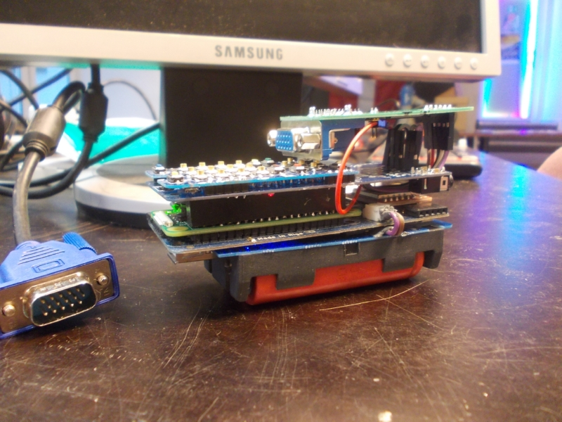
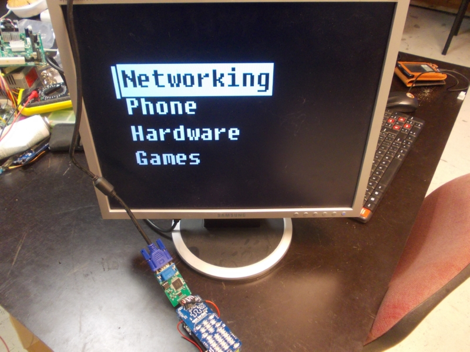
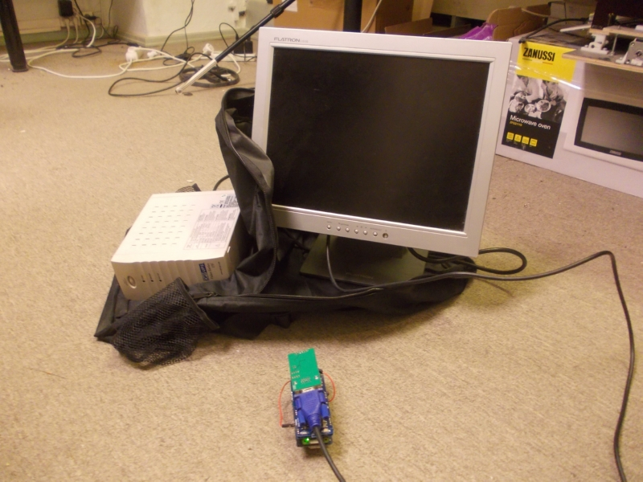

# Hello! This is a 1st of April joke, and I know it might not be obvious at first (especially given it was written to be non-obvious),
but I hope reading through this post will make that clear =) Howeer, if you're coming here
from the [Hackster post](https://blog.hackster.io/the-zerophone-a-linux-smartphone-powered-by-the-raspberry-pi-zero-286f36a25fd4)
through a hyperlink claiming ZeroPhone supports screens up to 1024x1280, fear not - it
does, indeed, since it has both [an SPI connection](https://zerophone.github.io/newsletter/ZeroPhone-Weekly-No.-11/)
and [a MiniHDMI connection](https://www.crowdsupply.com/img/6362/zerophone-dev_jpg_project-body.jpg), allowing
to both plug in small&portable displays, as well as the bulky&high-res ones, and quite
some in between. Enjoy the newsletter... oh, and [follow us on Twitter](https://twitter.com/@ZeroPhoneOSHW) =)

  
 Over the course of this year I've had multiple discussions with people asking for a bigger screen. Even though[ I've stated my reasons behind that decision](https://hackaday.io/project/19035-zerophone-a-raspberry-pi-smartphone/log/57417-why-not-a-large-display-with-a-touchscreen), I've come to understand this perspective, and I've found myself agreeing with it more and more as the project progressed. The more I used large-screen computers (my laptop, my Replicant smartphone or other computers), the more it dawned on me that small screens are, indeed, the way of the past. So, I think it's time to make some radical changes to address this issue.  

   
   
 Starting now, ZeroPhone no longer supports (or endorses usage of) 1.3" OLED screens. Instead, I'm going to use VGA screens - compared to meagre 128x64 resolution that ZeroPhone could offer, now you can build a ZeroPhone with a 1280x1024 screen, while still keeping the cost low! All that's left is designing a 3D-printed hinge for the VGA converter board, that would also makes ZeroPhone into, technically, a flip-phone - in fact, a first flip-phone (technically) that is also a smartphone (technically) ;-)   
   
   
   
 As you can see, first thing I did is porting ZPUI onto it, making sure that our software stays compatible. This modification only makes the ZeroPhone a mere 2cm thicker (which isn't significant, since it's already more thick than it's wide). The only additional component that you will need is a FPGA board - which can be programmed using open-source tools! The FPGA chip itself is easy to get and is cheap (7$), you can get it from Digikey, eBay, Aliexpress - [as it already is with all the ZeroPhone parts](https://wiki.zerophone.org/index.php/Sourcing_ZeroPhone_parts). While it does come in a small-pitch package (0.5mm) , don't let that deter you from attempting ZeroPhone self-assembly - the benefits visibly outweigh the suffering that you will go through while fixing your inevitable soldering mistakes.  
   
 Dropping OLED displays in favor of VGA also prevents a lot of the sourcing issues I've had. VGA is a widely adopted standard, which means a chance of you getting the wrong display are vanishingly slim. VGA-enabled displays are easily sourceable locally, as opposed to those 6$ OLEDs which you essentially have to use eBay for (which also is an important step - allowing ZeroPhone users to decrease their dependency on PayPal). Now, you might be wondering - why not use the MiniHDMI port, and the abundance of HDMI displays that are compatible with it? Even though using HDMI could've also allowed for a smaller footprint, using the HDMI port will require users to make use of non-free GPU firmware. I know that the majority of people are fine with it, but I do think that should be a conscious choice and not something I force upon users.  
   
   
   
 Last but not least, during beta-tests, I've received some feedback about VGA screens being hard to carry, or locate on demand. Worry not - the modification I've made is plug-and-play! This means that, even if you're in a restaurant, or a bank, and you don't have a VGA monitor with you, you can ask to use any suitable VGA monitor that you spot (such as those that waiters or bank tellers will certainly be using), plug your ZeroPhone in and use it to your heart's content! Portability is, undeniably, an important matter. While most VGA displays need 220V to operate, you can easily work around that by carrying a small UPS in a backpack, only actually plugging in your display while you need to use your ZeroPhone! This way, you also lower our carbon footprint - only using certain parts of the ZeroPhone when you need to.  
     
 The OLED-to-VGA hardware [was made by uXe from Arduboy forums](https://community.arduboy.com/t/vga1306-vga-out-for-diy-arduboys-implemented-on-an-fpga/4851). All the hardware pictured is indeed real and functions as depicted (except the UPS, the battery is dead, as it usually is).  
   
---

## P.S.

If you have any suggestions, comments, project ideas or wishes - you can [fill out the survey](https://zerophone.github.io/newsletter/survey/), reply to this e-mail, reach me on [Hackaday](https://hackaday.io/CRImier) or [Reddit](https://www.reddit.com/user/CRImier), maybe comment on [the Hackaday project](https://hackaday.io/project/19035) - whatever works for you! Also, consider supporting me on[ Liberapay](https://liberapay.com/zerophone/), or [donating on PayPal](https://www.paypal.me/TheZeroPhone) !  
   
If you're new to this project, absolutely do [check out ZeroPhone Wiki](http://wiki.zerophone.org), as well as [newsletter archives](https://zerophone.github.io/newsletter/) - and don't forget about [the Hackaday.io page](https://hackaday.io/project/19035)!

  
