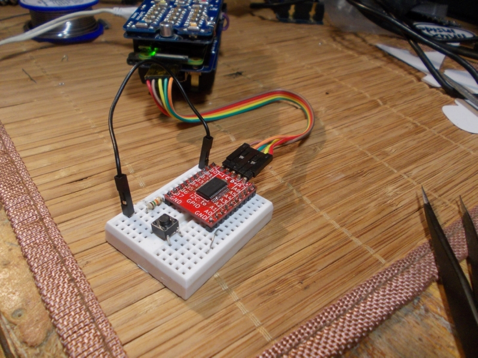

# Mod boards, delta PCBs, Avrdude app, pick&place and videos

   
 The delta PCBs are here! They're enough to build 20 phones, same as the last batch that I built exactly a year ago. There's also a large quantity of mod boards - boards that will show the ZeroPhone expansion capabilities during the crowdfunding, as well as act as a reference for all of the addons that ZeroPhone users might think of.  
   
   
   
 For example, this is a board that gives 16 GPIOs to the ZeroPhone. ZeroPhone mainly uses (and exposes) the high-speed interfaces available on the Raspberry Pi GPIO pins [(description available here)](https://wiki.zerophone.org/index.php/Gamma_board_Pi_GPIO_mapping). This means that there aren't as many GPIOs available for people looking to control things like relays and LEDs - as a solution, this small board gives you 16 more. I also have ideas about seamless software integration - so that you will be able to just replace "*import RPi.GPIO as GPIO*" with "*import ZP.GPIO as GPIO*" and have everything work. Shameless plug - [I'm also selling this board on Tindie](https://www.tindie.com/products/CRImier/16-pin-breadboard-friendly-gpio-expander-i2c/), as it's compatible with plenty of devices, like Arduinos and Raspberry Pi, not just ZeroPhone.  
   
   
   
 When it comes to software, I recently needed an app to flash bootloaders to ATMega328P-based boards in an user-friendly way, [and decided to make an example out of it.](https://hackaday.io/project/19035/log/148609) The result is a powerful app that uses Avrdude, which also brought a ton of ZPUI bugfixes/improvements and, in particular, a developer-friendly wrapper for running, monitoring and interacting with external processes, which is helpful if you want to build an app that, for example, livestreams video to the internet using ffmpeg. This is far from the only update, however - there's a huge update in ZPUI master branch, with context, canvas, UI and logging work finally making it out of devel branch. There's now also [a "How to" page on ZPUI development](http://zpui.readthedocs.io/en/devel/howto.html), giving you best practices and tips for writing your own ZeroPhone apps.  
   
   
   
 Now that I've received the mod boards, I'm going through each one of them, assembling them, testing - I've already found plenty of small errors and mistakes. Some addons work well, some will need to be re-made, some need a small fix or two - like flipping a transistor before soldering it, bending IC legs or making a small cut with the Xacto knife. I'm also thinking about software support - for example, the recent Avrdude app will be a good base for apps working with I2C and SPI EEPROMs, so that anybody will be able to copy and restore an SPI BIOS flash with a press of a button (giving you a nice tool for battling Intel ME on your laptop). On the other hand, connecting an Ethernet mod board should be just as convenient (though, unfortunately, not plug&play), but needs more interaction with the system, so I have to think of the right way to expose it to the user (without relying on shoddy shell scripts). Some kind of "addon manager" could be in order... sooner or later, when it will look more clear to me =)  
   
   
   
 Here are some of the addons that I've assembled so far. In the center is the USB-UART board, which is a drop-in replacement for Chinese charger boards that ZeroPhone uses to charge the battery, but also gives you the capability to connect to your ZeroPhone's UART using the MicroUSB port - which is moderately useful in day-to-day ZeroPhone work, but extremely useful for ZeroPhone-related development, especially hardware and kernel driver work. Then, there's the ENC28J60 breakout adapter, allowing you to connect your ZeroPhone to Ethernet networks (it even has a Linux driver already!). Next to it is the NRF24L01 adapter, bringing the ubiquitous 2.4GHz radio module to ZeroPhone and allowing you to build your small 2.4GHz mesh network - or sniff the 2.4GHz communications around you! Next to it is the adapter for RFM01/12/69 radio modules, which allow you to communicate on ISM frequencies like 315/433/868/915MHz. There's also a simple pinout adapter for a wide range of Chinese I2C-powered modules - from compasses and accelerometers to contactless temperature sensors and OLED displays.  
   
   
   
 Then, of course, there are the 3G mod boards - waiting for the right modems. In the top right corner is the dock board, allowing to build dock stations and the like for ZeroPhone - I'll be showing more of that during the crowdfunding ;-) There's also a level shifter addon - making sure you can safely experiment with both modern 1.8V interfaces and older 5V interfaces, and I'll be testing it once I find suitable SMD pin headers somewhere locally. Then, there are all kinds of not-exactly-mod boards: small optocoupler boards I made so that I could safely connect to other equipment, 74HC595 boards for quickly adding serial-driven outputs to my projects, multi-LED boards for easier project debugging - and so much more boards that are just begging to be assembled.  
   
 Here's [the GitHub repo with mod boards](https://github.com/ZeroPhone/ZeroPhone-Mod-PCBs) if you're interested - soon, I'll update the ["Mod boards"](https://wiki.zerophone.org/index.php/Mod_boards) ZeroPhone Wiki page to tell you more about each of them in more detail. Also, I can now assemble the mod boards more quickly and productively, since [our hackerspace's pick&place finally works (video)!](https://www.youtube.com/watch?v=DDIs5n8euL0) Last year it didn't work, since the nozzles were low-quality - thankfully, I bought an upgrade from last year's Hackaday Prize money and we recently installed it, so now it finally can put components on boards precisely!  
   
 Today, [I also filmed a small video](https://youtu.be/iG2J-DwYaYc) - on how to order and panelize ZeroPhone boards. I picked up some editing and filming techniques, so now I hope I have less of a mental block when it comes to making videos... Editing is still time-consuming, though =( Right now, I'm working on a long video on assembling ZeroPhone Gamma boards, and editing is the part requiring the most effort.  
   
 Why make so many addons? First of all, ZeroPhone is extensible and even modular in a way, and I want to emphasise it - otherwise, it might end up being a hacker-friendly phone that doesn't visibly show its hacker-friendliness. Second reason is - mod boards are an experiment to supplement the project's income, which will allow us to manufacture and subsequently sell more ZeroPhones, fund ZeroPhone software development in various ways and develop further ZeroPhone hardware.  
   
 Now, I'm waiting on some components and, in particular, still collecting funds to ship a huge box of components here. Other than assembly woes, I'm mainly writing updates for the crowdfunding - something that I need to do before it actually starts, as during the crowdfunding there's always something better to spend your time on (like advertising, answering questions and dealing with unexpected things). When I have more time, I'll also be updating the BOM (together with the sourcing requirements on the Wiki) for the Delta boards.  
   
 Please consider supporting me on[ Liberapay](https://liberapay.com/zerophone/), or [donating on PayPal](https://www.paypal.me/TheZeroPhone) ! I'm now building the batch of ZeroPhones, and there's plenty of components I still need to buy, but I don't have any income at the moment. I can cover my living expenses, but ZeroPhone development is harder to cover, unfortunately.  
   
 Finally, hope you liked [the previous newsletter](https://zerophone.github.io/newsletter/ZeroPhone-Weekly-No.-12/) ;-) Quite a number of people got confused by it - which looks like an indicator I did a good job =) Hopefully, I can release something as good the next year.   
   
---

## P.S.

 If you have any suggestions, comments, project ideas or wishes - you can [fill out the survey](https://zerophone.github.io/newsletter/survey/), reply to this e-mail, reach me on [Hackaday](https://hackaday.io/CRImier) or [Reddit](https://www.reddit.com/user/CRImier), maybe comment on [the Hackaday project](https://hackaday.io/project/19035) - whatever works for you!  
   
 If you're new to this project, absolutely do [check out ZeroPhone Wiki](http://wiki.zerophone.org), as well as [newsletter archives](https://zerophone.github.io/newsletter/) - and don't forget about [the Hackaday.io page](https://hackaday.io/project/19035)!

  