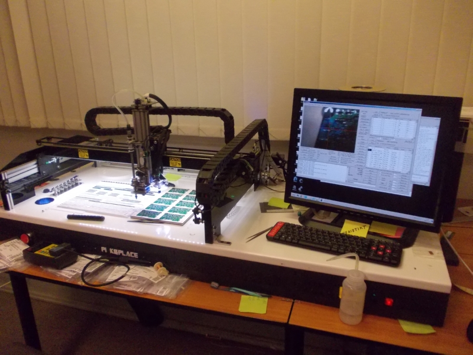

# Free kits for people with ideas, Delta-B revision +stream in 10 minutes

   
 Hi! This week, as you might've understood from previous newsletters^W stream announcements, we're working on assembling the first ZeroPhone Delta, as well as making the next revision of the PCBs. What's that about the next revision?  
   
   
   
 Recently, I've received an offer from a certain PCB manufacturer, to sponsor a batch of ZeroPhone PCBs. As I've got a working pick&place setup at our hackerspace and a big box of ZeroPhone components (including excessive quantities of SMD resistors and capacitors), I can easily assemble a small batch of ZeroPhone PCBs without much cost - provided I have the PCBs (there are still ICs and components that I need to stock up on, so I'm currently trying to find money for that). Given that I already am going to build a batch of 20 phones for reviewers and developers, it shouldn't be that hard for me to build 20 more SMD-only kits, what's with the pick&place working and all.  
   
 What would those kits be for? Through this year of interacting with people on this newsletter, I've come to see that there's a lot of people interested in getting a development version, before the crowdfunding starts. I've sent out a number of Gamma ZeroPhones to developers already, but it was a result of interactions between me and said people - and I'm sure there are more people that haven't voiced their interest in developing for ZP in early stages, but are still waiting.  
   
 So, **I'm interested in building a batch of free kits** - for people on this mailing list that have some kind of development idea and don't mind having to source breakouts from eBay. In next newsletter, I'll send you a survey (either self-hosted or hosted on a reliable open-source platform, so, not Google Docs), so that you can submit your idea and have a chance to receive a free kit! I'd sell those kits for a nominal price, but I don't want to exclude people - even if you're not currently able to cover some kind of nominal price, I believe you should be able to join our effort in making ZeroPhone a better phone for everybody.  
   
 Accordingly, I need to make sure that the SMD-only boards will work once I send them. It turned out that Delta boards work OK overall (and are better thought-out than Gamma boards), but some of the reliability additions on the back board (like undervoltage comparators, charger-to-DCDC switchover and the ID EEPROM) don't work. We've already found solutions for most of these problems together with those of you that participated in this week's Twitch streams, now it's time to release the next revision! Additionally, for those people that have Delta boards, there's going to be after-assembly fix instructions on the Wiki ([as it is with Gamma boards](https://wiki.zerophone.org/index.php/ZeroPhone_assembly_checklist))  
   
 Of course, a newsletter wouldn't be complete without a stream announcement! [In 10 minutes, I'm streaming on Twitch](https://www.twitch.tv/crimier) - we're going to be working on Delta boards, testing workarounds to the problems, as well as designing the new PCBs. I'm going to be doing that until 11-12PDT, so USA-based followers have a lot of opportunities to catch up. I'm also looking for ideas for a Europe-centric stream, and I'll be doing those as soon as I know the topic, as well as fix my sleep schedule back to normal.  
   
 Yesterday, closer to the end of the stream, we were testing the new ZeroPhone Delta addition - a GSM speaker amplifier, which will make sure you hear your ZeroPhone when it rings, as well as will likely enable us to have a "Loudspeaker" function during calls. [We made a short video playing Twinkle Twinkle Little Star using the DTMF tones](https://www.youtube.com/watch?v=NCBLMA-uAHo), too ;-P  
   
 Last but not least - don't forget to follow [@ZeroPhoneOSHW on Twitter](https://twitter.com/@ZeroPhoneOSHW) for daily updates and photos, Twitch stream announcements and answers to your most pressing questions. Also, I'm sourcing some components for the free batch of kits - even though I have 5 reels of most popular SMD components and copious amounts of not-so-popular components, I still need to find about 7EUR worth of components for each board - specifically, ICs, MOSFETs and the audio jack (which is hard to source separately, so I'll be supplying it with the free kits), as well as packaging for kitting&shipping. So, if you're interested in helping me fund the free kit batch, [you can donate through PayPal](http://paypal.me/TheZeroPhone)! Also, Liberapay has temporarily stopped accepting payments due to issues with MangoPay - I'm looking for other solutions for us to cover recurring costs like hosting, email and SMD component replenishments, and I'll let you know once I've found a solution.  
   
 There's now[ photos.zerophone.org](http://photos.zerophone.org) - an archive of all ZeroPhone photos I made, for all 4 revisions! If that's something that'd interest you, feel free to browse through those =)  
   
---

## P.S.

 If you have any suggestions, comments, project ideas or wishes - you can [fill out the survey](https://zerophone.github.io/newsletter/survey/), reply to this e-mail, reach me on [Hackaday](https://hackaday.io/CRImier) or [Reddit](https://www.reddit.com/user/CRImier), maybe comment on [the Hackaday project](https://hackaday.io/project/19035) - whatever works for you!  
   
 If you're new to this project, absolutely do [check out ZeroPhone Wiki](http://wiki.zerophone.org), as well as [newsletter archives](https://zerophone.github.io/newsletter/) - and don't forget about [the Hackaday.io page](https://hackaday.io/project/19035)!

  