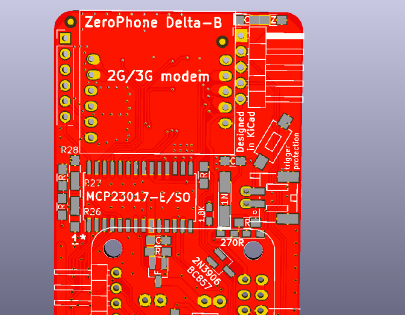
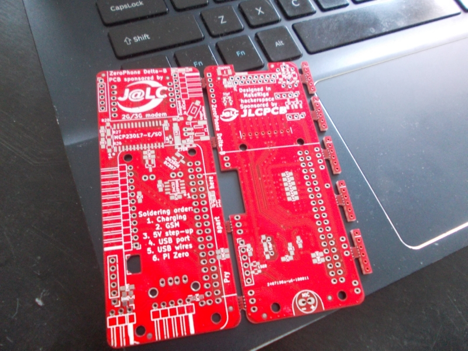
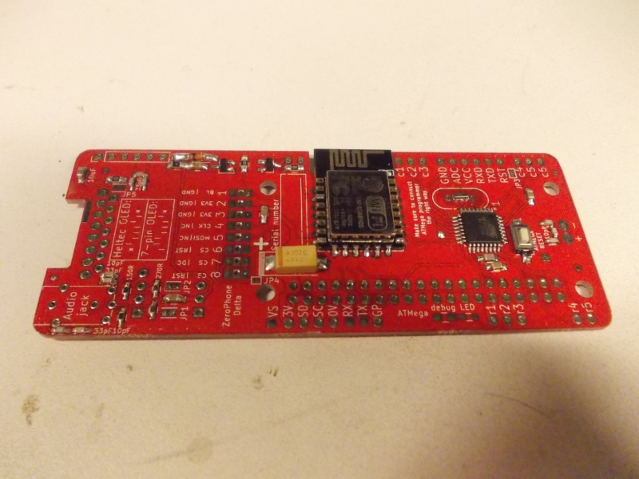

# Delta-B released,JLCPCB batch, new developments + rework stream now

   
   
 There's a new revision in town! It's called Delta-B, and it's supposed to fix all the mistakes I made in the Delta boards - those mistakes mostly concern the additions I made to Delta. The most significant of those mistakes is the fact that the ID ("HAT") EEPROM on Delta boards doesn't work together with the MCP23017 GPIO expander - preventing our software from actually being able to distinguish Gamma hardware and Delta hardware, and that's a bad idea since those revisions are different enough and both of them are already distributed among contributors. Thankfully, the fixes we made can also be retroactively applied to Delta boards, but they have to be applied manually - adding a PNP transistor and cutting a couple of traces with an Xacto knife. The new revision fixes this, and more mistakes.  
   
   
   
 [JLCPCB](https://jlcpcb.com/) has sponsored the kit batch for Delta-B kit giveaway! The PCBs have recently arrived - together with proper stencils, something that will really help decrease the amount of soldering mishaps after reflow (which is something I have to fix manually, and it takes time). Meanwhile, I'm preparing a form for kit requests - I'll most likely go with some kind of simpler solution, one where you won't have to disclose any of your personal data straight away (specifically, shipping info), though it will definitely require you to leave a contact email (unlike [the ZeroPhone survey](https://zerophone.github.io/newsletter/survey/)). Next newsletter will likely exclusively contain info about the giveaway, as well as some shilling for JLCPCB, them being sponsors and all - please don't scoff too much at me =)  
   
   
   
 Now, I'm reworking the Delta boards, so that I can go on pick&placing the other side. While Delta phones are not perfect, they're working pretty well after fixes are applied, which means I can still send them to reviewers and contributors. This stream is more Europe-centric - it's 8PM where I am, but that's only 5PM GMT, so most of the Europe should still be awake. As usual, [come watch me work, ask questions, all that.](https://twitch.tv/crimier)  
   
 On previous streams, we've had some ZeroPhone discussions, and together we came up with a new idea about something that you've asked for a lot (through [survey](https://zerophone.github.io/newsletter/survey/) responses, but also on the [subreddit](https://www.reddit.com/r/ZeroPhone/), [IRC](http://kiwiirc.com/client/irc.freenode.net/#zerophone) and other channels). We'll prepare mockups and get back to you shortly - and we sure hope you like it ;-P  
   
---

## P.S.

 If you have any suggestions, comments, project ideas or wishes - you can [fill out the survey](https://zerophone.github.io/newsletter/survey/), reply to this e-mail, reach me on [Hackaday](https://hackaday.io/CRImier) or [Reddit](https://www.reddit.com/user/CRImier), maybe comment on [the Hackaday project](https://hackaday.io/project/19035) - whatever works for you!  
   
 If you're new to this project, absolutely do [check out ZeroPhone Wiki](http://wiki.zerophone.org), as well as [newsletter archives](https://zerophone.github.io/newsletter/) - and don't forget about [the Hackaday.io page](https://hackaday.io/project/19035)!

  