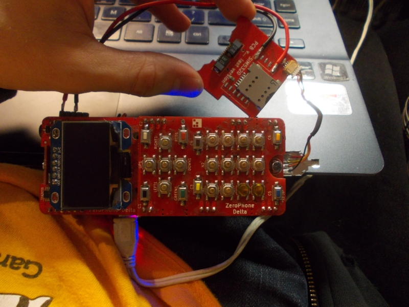

# Matrix app, Delta-B?, Hackaday Supercon, mockups and miscommunications

   
 First of all, welcome everyone that's new here - whether you're from the last month's Reddit threads, Hackster or somewhere else, there's a lot I've meant to write, but I've been delaying it... that's the norm on this newsletter, to be honest =D So, if you'd like to follow the project more closely and gain more insights into development: join our IRC (#ZeroPhone at freenode) and Matrix (ZeroPhone) rooms, follow us on [Twitter](https://twitter.com/ZeroPhoneOSHW) or [Hackaday.io](https://hackaday.io/project/19035), all that. It's going to be a longer newsletter - and it's going to be split into two parts, another part will be sent before the end of the month... for this part, let's start with technical news =) Also, if you're interested to discuss this newsletter after reading it -[ I'm streaming on Twitch right now](http://twitch.tv/crimier) , working on a small app to auto-debug WiFi problems for self-assembly, and there's going to be [a subreddit thread](https://www.reddit.com/r/ZeroPhone/) for those that don't catch the stream.  
   
 Oh wait, I'd just like to interject for a moment ... I'm going to be [at the Hackaday Supercon](https://hackaday.io/superconference/), which is happening in less than a week! It's a Hackaday.io-organized conference in Pasadena, LA, and I'll be speaking on Saturday after lunch - about building your own Linux-powered portable devices, challenges you'll encounter while doing so, things you need to think about, all that. Other than that, I'll be at the conference on Saturday and Sunday - if you're also attending, let's meet up! We'll likely coordinate the meetup through Twitter, but I'll be on Matrix/IRC the entire time, too.  
   
   
   
 [We have a new release - Delta-B! ](https://hackaday.io/project/19035-zerophone-a-raspberry-pi-smartphone/log/155274-delta-b-released) It fixes most of the mistakes that I have made in Delta - mistakes that resulted in [this](https://wiki.zerophone.org/index.php/ZeroPhone_after-assembly_fixes_(Delta)#Fixing_the_DC-DC_switchover_circuit) and [this](https://wiki.zerophone.org/index.php/ZeroPhone_after-assembly_fixes_(Delta)#Fixing_the_EEPROM.26MCP_INT_coexistence_circuit) ugly fix requirement... PSA: if you're assembling a Delta (not Delta-B) ZeroPhone yourself, I've made special fix PCBs for these two mistakes - reply to this email to get one if you're not comfortable making the fix. I ought to make a mailing list for such things, actually. The main reason for this revision is the free kit batch - which is coming soon, I'm receiving the last required components in the middle of next month, so I can finally make a proper announcement (and a way to apply!) without making a lot of people wait.  
   
 **Wait, I just read the last newsletter, and it seems I've already announced the Delta-B.** What the hell, I completely forgot about that ;-P Nevertheless, there's now a Hackaday.io post (first link of the paragraph), so it's cool, I guess.  
   
   
   
 Some Reddit users have asked about our plans for a touchscreen/QWERTY device... Here's a mockup of how the next ZeroPhone version (not "revision", like Gamma/Delta/Delta-B) might look, done by [@Morning.Star](https://hackaday.io/Jez.Boxall) over at Hackaday.io. The form-factor idea is mainly driven by sourcing requirements, featurefulness and nostalgy on hybrid Nokia phones. Also, the QWERTY layout and the external keypad&screen panel were not planned through yet, so don't be scared, nothing is set in stone yet and [feedback of all sorts is welcome](https://zerophone.github.io/newsletter/contact/) =) As for timing, there's no plans to start actively working on it before the crowdfunded ZeroPhones are shipped to the recipients, but I'm already designing various small helper PCBs to help with prototyping it. One question that's worrying me... at this point, does it make sense to call this new version a ZeroPhone? =D  
   
   
   
 3G modem addon boards have been tested to work - next modem PCB revision is on the way, and from the two boards we've assembled, one already was sent to USA and another one to UK, for further testing and development =) We also need to test the accompanying onboard USB hub... hope it works well, I've developed two different versions using two different ICs, so the chances are good that at least one of those works. In the meantime, [4G modem research is underway](https://github.com/ZeroPhone/Discussion-and-Research/issues/18) - there aren't a lot of options, so if you know of something, suggest it to us!  
     
   
 There are two important misconceptions about ZP that need to be cleared - here's the first one (second one will follow in the next part of this newsletter). First of all, aim of the upcoming crowdfunding campaign is making full ZeroPhone kits - ZeroPhone boards with SMD parts already attached, packed together with all the breakouts, so the only soldering required in order to make a phone is simple enough for most people. There will also be a limited amount of fully-assembled phones - as there are things I'm not yet sure can be automated, I can only promise a limited amount at the moment (also, regulatory compliance is a royal headache). If it proves to be cheap enough to fully assemble ZeroPhones, we'll assemble each and every kit fully, however, that's going to be researched at the manufacturing stage. Of course, we'll provide an assembly guide, with enough photos and diagrams so the assembly process will go smoothly, as well as a video, in case that's more suitable for you. If people are interested, we'll offer a known-to-work handpicked set of all necessary tools (soldering iron, solder, solder wick etc.) during the crowdfunding, too - for ZeroPhone assembly and for whatever hacking you might take upon after it =)  
   
 What's important is - these kits won't cost $50 during the crowdfunding (not <$100 either, somewhere in between). To put it simply, the $50 figure implies sourcing all the parts yourself - with large-scale production and fulfillment, there are undoubtedtly price breaks for components, but there are also fees, taxes, manufacturing expenses, whatever compliance tests we end up being required to do, shipping between facilities, emergency funds, and unexpected issues yet to be found. There's also a very important expense - being able to fund ZeroPhone software development (for both core software and apps), enabling people to contribute to the project and receive financial prizes (or hardware, if they so choose) - it's certain I won't be able to handle all of the development on my own, and I can't yet predict the amount of volunteer work that will be needed, so certain fundamental tasks will probably get bug bounties on them, and I'm toying with the idea of having app development contests. I'm still discussing this idea with people, and if you have some feedback, please reply to this email =)  
     
   
 For this month's first part of "about our contributors":  
   
   
   
 [derivmug](https://github.com/derivmug), a contributor that recently joined us, has contributed a Matrix messenger application - with encryption support coming soon! It's been a breakthrough for ZeroPhone and ZPUI, in that we *1)* got our first messaging application you can use from the ZeroPhone UI *2)* learned more about what's needed to make ZPUI a better UI framework, in general and for messaging apps in particular *3)* have an app that allows more people to use ZP as a daily driver. Kudos to derivmug - he's continuing to help us, having recently [created a calendar app](https://github.com/ZeroPhone/ZPUI/pull/115), and now he's helping us make the UI prettier by working on [a grid-based menu UI element](https://github.com/ZeroPhone/ZPUI/pull/123), which will become the base for the ZeroPhone main menu =) There are now hefty TODOs for [the Matrix app](https://github.com/ZeroPhone/ZPUI/issues/110) and [calenda](https://github.com/ZeroPhone/ZPUI/issues/101)r - if you'd like to help us, pull requests are welcome! If you're just interested in the source code, [here it is](https://github.com/ZeroPhone/ZPUI/tree/devel/apps/matrix).  
   
   
   
 [fnux](https://github.com/Fnux), a contributor that has recently assembled his own ZeroPhone, has set up a Dockerized version of InteractiveHtmlBom for us. If this doesn't say much, [here it is in action](http://assembly.zerophone.org/delta-b/back_pcb/) - it's an amazing KiCad-to-HTML converter that helps people self-assembling their own phones, it has simplified the ZeroPhone SMD assembly process, and this tool has already helped another contributor to assemble their own ZeroPhone. Here's[ the repo with the Docker file](https://github.com/ZeroPhone/bom_tools/tree/master/interactive-bom), in case you'd like to try and set it up for your own project (and if you need help with that, ask us on IRC).  
   
 [KyleMoran138](https://github.com/KyleMoran138) is helping us make a calculator app! The initial version, albeit primitive, has already been merged - now we have[ improved requirements ](https://github.com/ZeroPhone/ZPUI/issues/100)for it, and I hope the UI element development tutorial that I'm going to write soon will help it advance towards a user-friendly calculator, there when you need to calculate something in a pinch.  
   
 ---  
   
 Next newsletter will contain mod board announcements (USB Type-C!), more contribution priorities and kudos to contributors (there's now a Snake game in ZPUI!), Patreon and crowdfunding announcements, as well as info about case work (if I have enough time).  
   
 [We're MagPi's... 2nd place something?](https://www.raspberrypi.org/magpi-issues/MagPi75.pdf) (page 37) As far as I understand whatever this contest is called, that was people's vote, and I know some of you are here - love you all! Even if you voted for someone else - I know I did! Also, MagPi, I'm a little bit older than that =D  
   
---

## P.P.P.S.

 If you have any suggestions, comments, project ideas or wishes - you can [fill out the survey](https://zerophone.github.io/newsletter/survey/), reply to this e-mail, reach me on [Hackaday](https://hackaday.io/CRImier) or [Reddit](https://www.reddit.com/user/CRImier), maybe comment on [the Hackaday project](https://hackaday.io/project/19035) - whatever works for you!  
   
 If you're new to this project, absolutely do [check out ZeroPhone Wiki](http://wiki.zerophone.org), as well as [newsletter archives](https://zerophone.github.io/newsletter/) - and don't forget about [the Hackaday.io page](https://hackaday.io/project/19035)!

  
