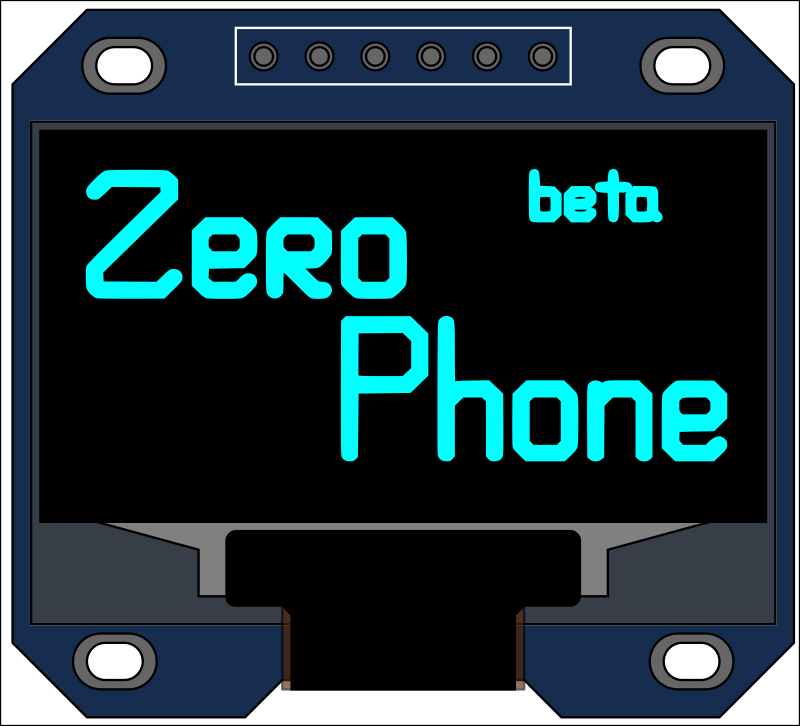
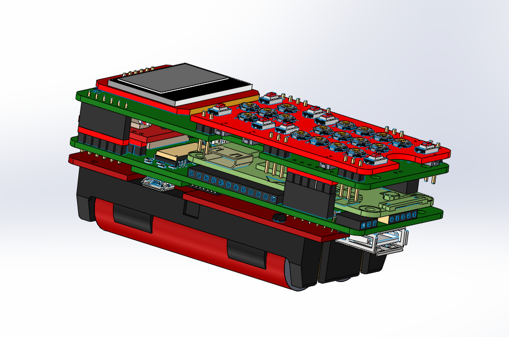
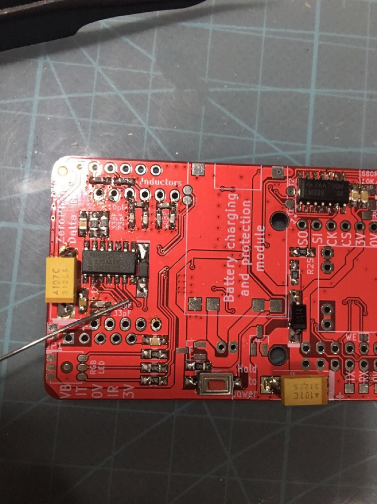
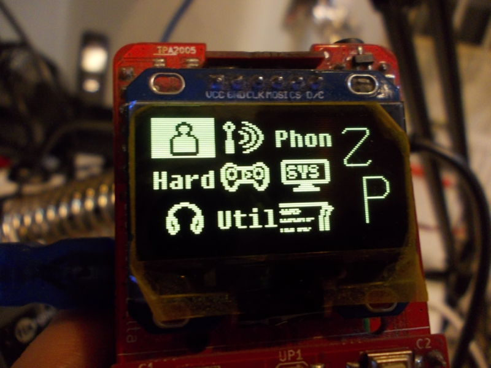
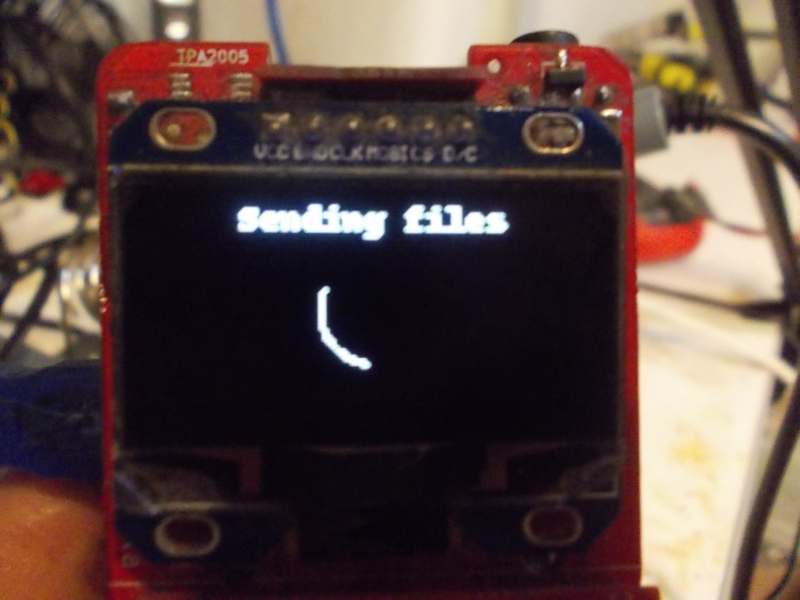

# (stream now) Crowdfunding, FOSDEM, cases, contributions and self-assembly

 Merry Christmas and Happy New Year to everyone! The crowdfunding date is set in the middle of February, the exact date will be announced closer to the launch. I'll be at FOSDEM this year, so will be starting the campaign after that - to make sure I'll have enough time to prepare for the launch. I'm thinking about some sort of meetup, so people that are interested can actually check out a ZeroPhone and talk about the project - I'll be thinking about the details in the meantime. I'll coordinate it through Twitter, most likely - will also do my best to release a newsletter before FOSDEM with extra details.  
   
 As it's now finally known to me when I launch, [I'm opening a Patreon page](https://patreon.com/zerophone) - to make sure I have enough finances in these two months, as well as during the manufacturing (so I don't have to allocate myself a wage from the campaign margins and could instead invest them back into the project as much as possible). I didn't want to start a Patreon page without a set date - and without any benefits for the supporters. For the latter, I've thought about ways to better keep people up-to-date with the project as it moves. I've found that posting on Twitter isn't all that efficient if you don't post at the right schedule, so I've stopped that until I'd find some kind of scheduling workflow - and now I have an excuse to make a scheduler tool, which is almost done.  
   
   
 *A sticker design by [@Morning.Star](https://hackaday.io/Jez.Boxall)*  
   
 As a result, on Patreon you can get sneak peeks at Twitter posts I'll be scheduling (mostly interesting photos and other bits&pieces from my ZeroPhone development as it happens day-to-day) - done through a tool I developed based on reverse-engineered Patreon API. Now I'm working on properly automating scheduled Twitter posts and notifications (reminding me to post daily or at least once in two days) in the same tool, which I hope to eventually open-source - as soon as I understand whether I can actually post the code that works with Patreon API. Also, there's going to be stickers, and there's even a way to subcontract me for a short amount of time to help you with a ZeroPhone-related usecase of yours! I also have ZeroPhone pages [on Liberapay](https://liberapay.com/zerophone) (which seems to accept Stripe&PayPal payments now) [and PayPal](https://www.paypal.me/TheZeroPhone). Please consider donating - so that the pre-launch preparations go more smoothly =)  
   
   
   
 [The ZeroPhone 3D model is now available](https://hackaday.io/project/19035-zerophone-a-raspberry-pi-smartphone/log/157655-3d-design-files-now-available) - exported from KiCad 5 with its native STEP export feature! Now, you can go on and design cases! I'll be sending personalized announcements to people that have expressed their interest, too - the aim is to have a usable case for Delta ZeroPhones in month's time (before the crowdfunding), and if nobody contributes one, I'll design one myself.   
   
   
   
 Are you interested in why self-assembly is such a priority for the project? [Here's a writeup on that](https://hackaday.io/project/19035-zerophone-a-raspberry-pi-smartphone/log/156705-why-is-self-assembly-important-and-why-use-chinese-breakouts), one that I had in the drafts for a long time and finally got to publish. As we're getting closer and closer to actually having full assembly instructions, I'll be keeping you updated - we'll be working on . In other news, right after this newsletter I'll be packaging an example ZeroPhone kit on Twitch! So, if you have some feedback for the newsletter, or just would like to see the kitting process, [come see me.](https://www.twitch.tv/crimier)  
   
   
   
 Our contributor, [derivmug](https://github.com/derivmug), has finished work on the calendar UI element & app and helped with some Matrix app usability issues. He's also contributed a grid-based menu UI element - thanks to his work and [Morning.Sta](https://hackaday.io/Jez.Boxall)r's work on the icons, we now have a custom grid-based main menu! It's one of the additions I'd really like to see before the new SD card image comes out, one that makes the phone easier to navigate for new ZP owners.  
   
 We've also been joined by [LouisPi](https://github.com/LouisPi), who's using the ZPUI framework in his own custom device on a color 128x128 LCD display, he is helping us make ZPUI compatible with such displays (with regards to both color and size), having recently contributed quite a bit of improvements that help us move away from our current "one screen type, one size and one usecase" paradigm. Our contributor and betatester, [piajesse](https://github.com/piajesse), has helped us by developing some functions which will improve developer-friendliness of ZPUI - specifically, determining the circumstances of how the ZPUI framework is running and limiting what it can and can't do.  
   
 Another contributor, [Gnu-Bricoleur](https://github.com/Gnu-Bricoleur), added the Snake game to ZeroPhone! I've been playing it from time to time now (whenever I'm bored and don't have my laptop with me), and it's a nice addition to have. It also never fails to grab attention from other people! What I have now is a small call for participation - help us make the Snake game better!  
   
   
   
 [We now have bugreporting in ZPUI!](https://github.com/ZeroPhone/ZPUI/issues/80) What this means is - from the ZeroPhone UI, you can send ZPUI/ZeroPhone logs (and some other kinds of info) to our server if you've found an error and would like to help us debug it. It's going to be especially helpful when the SD card image that supports calls is ready, as then we'll be able to debug ofono-related problems much easier. Of course, this is opt-in, and all our code is open-source (both client and [server](https://github.com/ZeroPhone/vsftpd_log_box)). I'll also be working on exposing this code to apps that other people write - so that every app developer can take advantage of this feature. This is the last thing I need before beta-testing calls - apart from, well, actually shipping a beta-testable SD card image for calls, working on that right now.  
   
---

## P.P.P.S.

 If you have any suggestions, comments, project ideas or wishes - you can [fill out the survey](https://zerophone.github.io/newsletter/survey/), reply to this e-mail, reach me on [Hackaday](https://hackaday.io/CRImier) or [Reddit](https://www.reddit.com/user/CRImier), maybe comment on [the Hackaday project](https://hackaday.io/project/19035) - whatever works for you!  
   
 If you're new to this project, absolutely do [check out ZeroPhone Wiki](http://wiki.zerophone.org), as well as [newsletter archives](https://zerophone.github.io/newsletter/) - and don't forget about [the Hackaday.io page](https://hackaday.io/project/19035)!

  