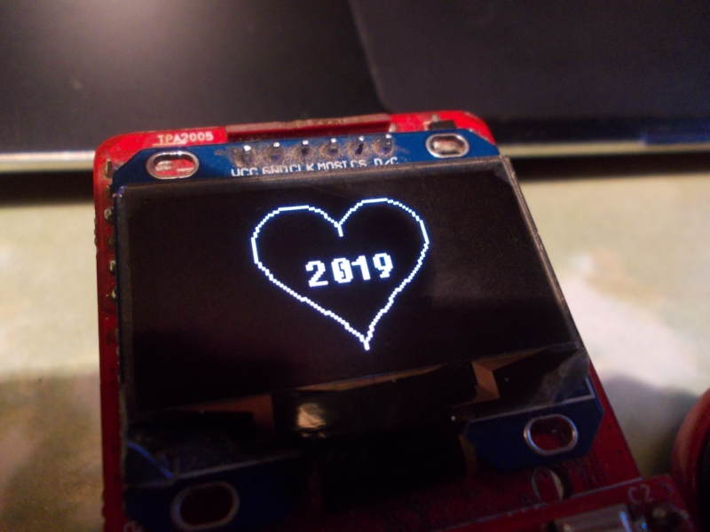

# Happy New Year from ZeroPhone!

   pi@zerophone:~/ZPUI $ sudo python main.py -a apps/example\_apps/sandbox/  
 [...]  
 >>> c = Canvas(o, interactive=True)  
 >>> font = ("Fixedsys62.ttf", 20)  
 >>> c.text("Happy", (10, 5), font=font)  
 >>> c.text("New", (49, 25), font=font)  
 >>> c.text("Year!", (70, 45), font=font)  
 >>> c.display()    
 *This is [a Twitter thread](https://twitter.com/ZeroPhoneOSHW/status/1079775404066521088) that I decided would be suitable for a newsletter.*  
   
 Happy New Year to everybody in this community! This was an eventful year for this project, and I'd like to thank everyone that followed, promoted, discussed, supported and contributed to ZeroPhone. We're close to properly achieving all our self-assembly goals, and crowdfunding is coming!  
   
 This year was more-or-less calm - the upcoming year is going to be hectic, with call software rollout for our beta-testers, major software changes, a FOSDEM trip and the crowdfunding start just in the first two months, and it's only going to get more involved from there.  
   
 Thankfully, a lot of people helped - making pull requests with their apps, UI elements and 3D designs, helping with issues, giving suggestions, sending ideas, asking questions, providing answers, maintaining the Wiki and docs, sending hardware, donating, and spreading the word.  
   
 In particular, this year I went to FOSDEM thanks to a large donation from a supporter, and to Hackaday Supercon thanks to the support from Hackaday , where I could meet some of you in person (and distribute some ZP prototypes) - always a pleasure. We also bought lots of parts!  
   
 Two ZeroPhone batches so far (Gamma and Delta) have been partially sponsored by Hackaday Prize and money that you donated. Plus, of course, PCBs&parts for different mod boards, hardware experiments, fixing&replacing broken parts, and getting tools. Hardware ain't cheap, but you helped bring it to life!  
   
 In 2019, hopefully ZeroPhone will get as complete as I believe it has to be, with new features, UI additions, apps, useful software, hardware mods and addons (even CPU boards!) on my roadmap. There's always some cool ideas, hope we can stay focused and keep the right direction =)  
   
 But most importantly, I hope our small community will continue to grow and advance - having people from all walks of life, each one finds something different in this project and what it can give to them; it's always fascinating to hear about different ideas and usecases.  
   
 Thank you for your support. Hope this year brings you good things and luck, and I hope that, this year, some good things in your life will be a result of the work we do on this project - whether it's the ZP itself, the UI, hardware hacks, knowledge and ideas, or the community. 💗  
   
   pi@zerophone:~/ZPUI $ sudo python main.py -a apps/example\_apps/sandbox/  
 [...]  
 >>> c = Canvas(o, interactive=True)  
 >>> import numpy as np  
 >>> t = np.arange(0,2*np.pi, 0.1)  
 >>> x = 16*np.sin(t)**3  
 >>> y = 13*np.cos(t)-5*np.cos(2*t)-2*np.cos(3*t)-np.cos(4*t)  
 >>> points = [(int(x[i]), int(y[i])) for i in range(len(t))]  
 >>> p = [(c.width-a-65, c.height-b-35) for a, b in points]  
 >>> c.polygon(p)  
 >>> font = ("Fixedsys62.ttf", 16)  
 >>> c.centered\_text("2019", font=font)   
   
   Thank you all for bringing me up to $100 [on Patreon](https://patreon.com/zerophone). This will go a long way towards making sure I have a safe trip to FOSDEM in February! If you have any suggestions, comments, project ideas or wishes - you can [fill out the survey](https://zerophone.github.io/newsletter/survey/), reply to this e-mail, reach me on [Hackaday](https://hackaday.io/CRImier) or [Reddit](https://www.reddit.com/user/CRImier), maybe comment on [the Hackaday project](https://hackaday.io/project/19035) - whatever works for you!  
   
 If you're new to this project, absolutely do [check out ZeroPhone Wiki](http://wiki.zerophone.org), as well as [newsletter archives](https://zerophone.github.io/newsletter/) - and don't forget about [the Hackaday.io page](https://hackaday.io/project/19035)!

  