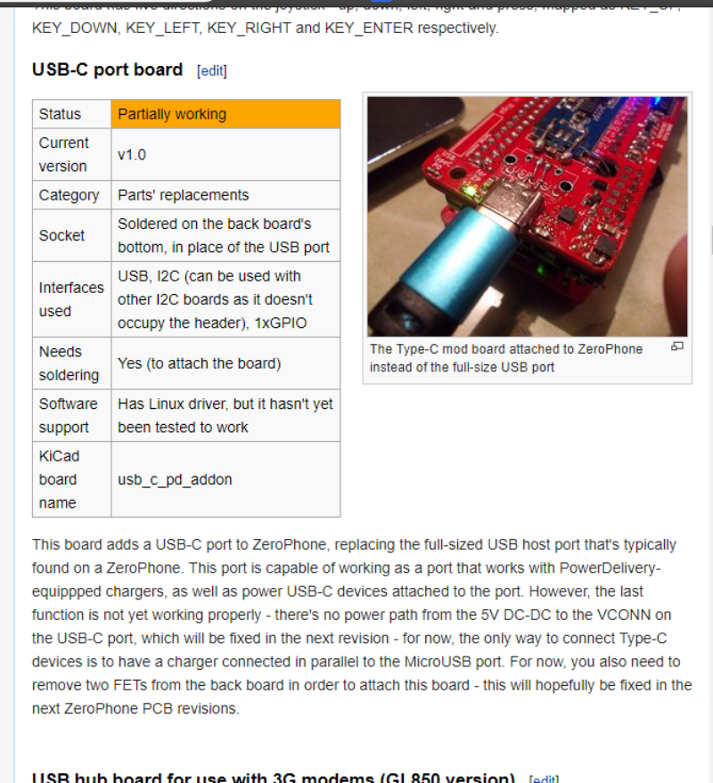
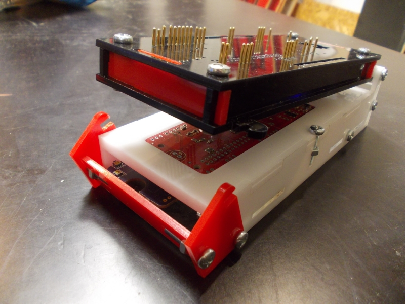
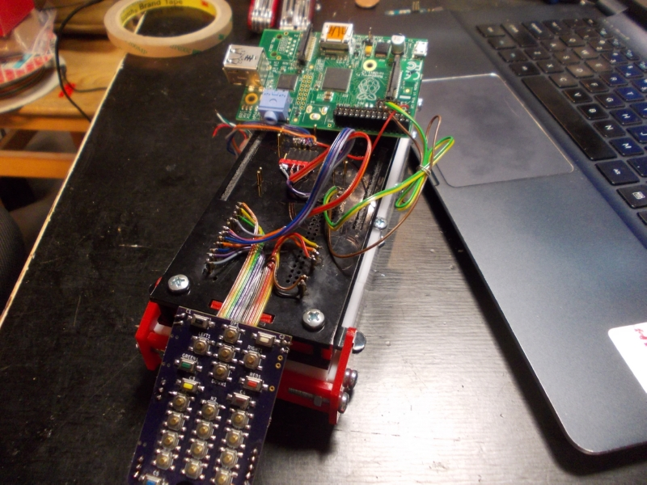
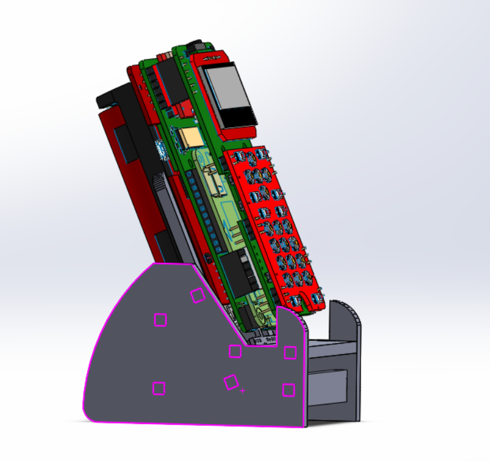
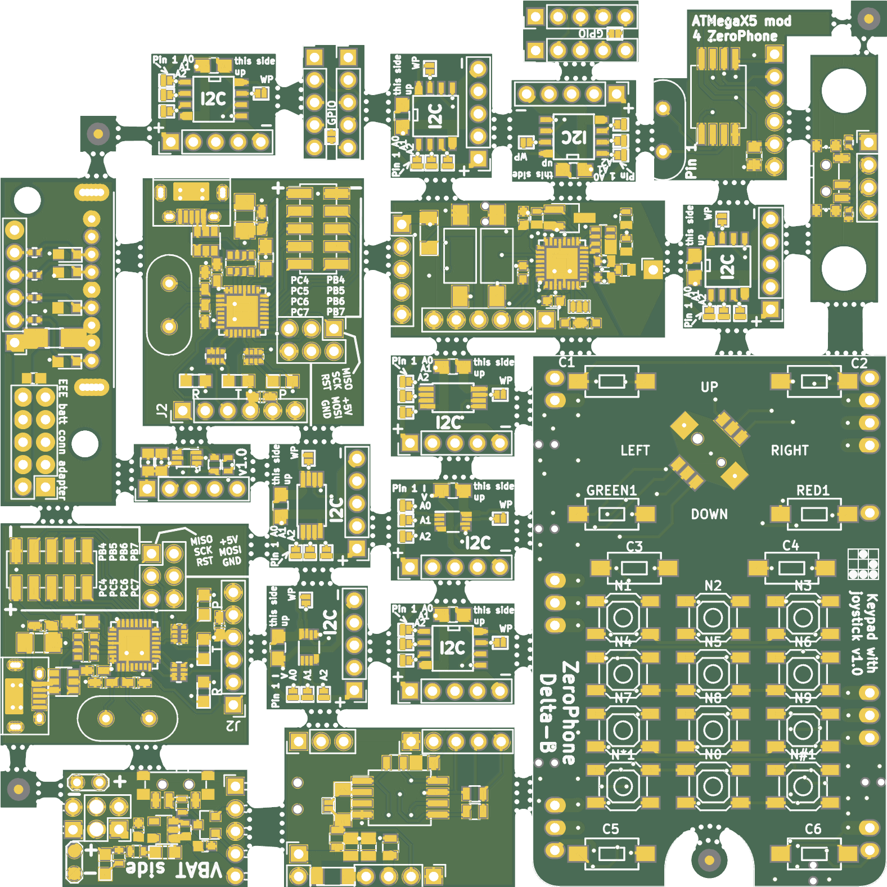

# (stream now) Free kit giveaway preparations,alternative CPU board, mod boards+ small updates

   
 Hi! First and foremost, [right now I'm streaming on Twitch](https://www.twitch.tv/crimier) - designing a replacement CPU board for ZeroPhone! The board is based on [the OSD3358 SiP](https://octavosystems.com/octavo_products/osd335x/), a chip that incorporates the CPU used in BeagleBone boards, some RAM and power management. This allows people to be able to get rid of the proprietary bootloader in Raspberry Pi if they want to, as well as, in general, gives people more options - which is a good thing. I'm going to base my design off [PocketBeagle](https://beagleboard.org/pocket), but the form-factor, pinout and connector placement will copy the Pi Zero to the extent that it's possible.  
   
 See you soon at FOSDEM, this week already! Will have hardware to show, stickers to give away and even some sneak peeks at what's coming! Will do my best to ensure we get [a BoF room](https://archive.fosdem.org/2015/news/2015-01-30-bof-announce/) on Saturday, worst case - Sunday. For me, this involves waking up as early as possible on Saturday, after arriving at 1AM at night - oh well, gotta make sacrifices =D  
     
 You might recall,[ last year I have mentioned](https://zerophone.github.io/newsletter/ZeroPhone-Weekly-No.-14/) that we might get sponsorship for a small batch of free kits, without breakouts (which are a major part of the expenses), but with SMDs already populated so that the trickiest soldering is already completed. So, here we are - I found sponsors and arranged some deals, I'm writing helper software so that I can start the board assembly, preparing photos, giveaway rules, participation form questions, calculating the expenses, all the good stuff.  
   
 This newsletter is a warning of sorts: next newsletter will be the actual announcement, photos, rules and everything - as well as a part where I list the two companies that sponsored the kit parts and PCBs and promote them. If you're allergic to advertisements (which is what I'll technically be doing), you have been warned. Nevertheless, I assure you that everything I write in the next newsletter is going to be fully honest, as me (and/or people I know personally) have actually ordered parts, PCBs and stencils from our sponsors before. So, if you've been burned by people advertising stuff they haven't personally used and know nothing about - I don't do things like that.  
   
 Apart from the two companies I'll be talking about, this kit giveaway is also partially sponsored [by my Patreon supporters](https://patreon.com/zerophone) and people that have donated to the project [using PayPal](https://www.paypal.me/TheZeroPhone). While I have most of the parts needed, I still need to source some parts that couldn't be sponsored (i.e. headphone jacks, I have to include those as they're very expensive on eBay), as well as pay for packaging and shipping - this is where you can help. What do I give you in return?  
   
 Mainly, lately I've been focusing on making realtime updates - during my ZeroPhone work, I take pictures of the cool stuff I'm working on, with detailed descriptions. Patreon and Paypal supporters get these updates immediately (with PayPal, I'll invite you to a private mailing list using your PayPal email address). Then, on a schedule, these updates (except some) will be posted on Twitter, where everybody gets to see them - though with a delay, since I only schedule 2 update tweets per day. In addition to that, both Patreon and PayPal users are permanently mentioned in an app inside ZeroPhone (this is opt-in for PayPal supporters, you will get an email), and Patreon supporters, depending on the support level, can get some tangible rewards - stickers, gift packages with some chocolate and electronics, and even a way to subcontract me to work on a ZeroPhone-related task! These rewards are also possible for PayPal supporters, though you need to contact me for that.   
   
   
 Now, onto project news! The sad news is - I had to delay the crowdfunding due to a couple of small but important deadlines I've missed. This is mostly related to the Chinese New Year - I have an order of important parts (3G modems, Arduinos for the free kit batch, mod board parts) that I need to get before the crowdfunding, and I couldn't place it in time. I will place it as soon as possible, in the meantime, I'll be working on all the loose ends I need to tie up before the crowfunding starts. The free kit batch preparations also played a role - there's a lot I need to prepare, and I'd rather it all goes through and gets shipped before the crowdfunding starts. Sorry for this delay.  
   
 I've updated [the "Mod boards" page on ZeroPhone Wiki](https://wiki.zerophone.org/index.php/Mod_boards). Right now, it's a full listing of all mod boards I've ever designed, some even have photos! This is so I can offer some mod boards to go together with the free kits - to make sure that people can work on the ZeroPhone's hardware potential, and if I don't have descriptions of the boards, people won't know if they might be useful for their project or not. I'll be making more photos of the boards that I've assembled, of course, right now, I just added all the photos that I actually took.  
   
 I've been thinking about ways for people to sell PCBs - since once you order 5pcs/10pcs of ZP sets, you will inevitably have some left over. If you're one of these people that has leftover PCBs, [now there's a page where you can list them for sale!](https://wiki.zerophone.org/index.php/Selling_PCBs) As a result, you can recoup some of your PCB investment (if not all of it), and other people don't have to invest anything into buying 10pcs at a time.  
   
   
   
 Check out this test jig! This one is for front boards, I've already used it for the small experimental batch of kits that I'm building. The idea is simple - since I'm sending kits, I can't test the boards once they're soldered together as a working phone (like I usually do), as it's the recipient that solders everything together. I only can test the boards in the same form that I put them into the kit packaging - nothing but SMDs populated; as a result, I need some sort of tool to non-permanently connect to the PCB and test all the functions that the SMD components are responsible for. This is essentially what a test jig does - with this specific test jig, I can test:  
   
 1) the TPA2005-based GSM speaker amplifier  
 2) the 3.5mm audio output  
 3) pre-flash the ATMega (so that people receiving kits don't have to use a USB-UART to flash the firmware in)  
 4) whether the ATMega works as an I2C device  
 5) how the ATMega scans a keypad  
 6) the ESP8266 soldering, see if the ESP responds to commands  
   
 Such a test jig will be used during ZeroPhone kit production, eventually. What's the great thing about this jig? It was generated almost-instantly [by the OpenFixture script](https://tinylabs.io/openfixture/), this script takes your KiCad PCB files and outputs a DXF design for a test jig that you can then lasercut, almost no effort on your part is required.  
   
   
 *Work-in-progress electronics*  
   
 New PCB version? ZeroPhone Delta-C might be coming soon, [we have some issues we need to fix](https://github.com/ZeroPhone/ZeroPhone-PCBs/projects/1). Need to find a free day, sit down, make and test all the changes, then order it from somewhere... Hopefully, after Delta-C, we can finally have ZeroPhone Epsilon, a version that just works perfectly and has no problems whatsoever =D  
   
   
   
 In the meantime, here's a new design that you will likely see offered during crowdfunding - it's a dock station for a ZeroPhone! I designed ZP in a way that exposes I2C, USB and charging pins on the bottom - so, you can design devices which the ZeroPhone *plugs into*, i.e. a dock with speakers, a a hardware workbench with tools that your ZP monitors, or a DIY alarm clock that throws you off the bed. There's an EEPROM on the dock PCB, so that you can make your ZP distinguish between different docks you can plug it into. The dock I've built at the moment is mainly useful for charging, but I'm also looking to add some I2C sensors to it, i.e. a CO2 sensor so that my phone can alert me if I need to open a window in my room. I'm also working on a loudspeaker dock, hope to show it soon =)  
   
   
   
 I've ordered a new panel with a lot of new ZP addons (and some unrelated PCBs). Some addons are already tested and known to work, some are experimental (the ones without silkscreen markings). This panel should arrive this morning, I hope to have it assembled before FOSDEM (using our pick&place and the stencil I ordered with the panel), in the meantime, here's a sneak peek! The addons without markings are not yet known to work, one isn't even listed on the Wiki, it's that experimental ;-P  
   
 We have a new contributor, ser234! They've assembled their own ZeroPhone, and now they've contributed a new Calculator app - helping us get a new, better calculator in ZPUI, so you can crunch numbers on the go without having to carry yet another device just for that =D Additions like these help make the ZeroPhone more independent, and it's very important for all the people that want to use a ZeroPhone as a daily driver.  
   
 That is all for today - hoping to release a small newsletter right before FOSDEM, just to give more details about the meetup. Also, I'm setting up some mailing lists, hope you'll like them =)  
   
---

## P.P.P.S.

 If you have any suggestions, comments, project ideas or wishes - you can [fill out the survey](https://zerophone.github.io/newsletter/survey/), reply to this e-mail, reach me on [Hackaday](https://hackaday.io/CRImier) or [Reddit](https://www.reddit.com/user/CRImier), maybe comment on [the Hackaday project](https://hackaday.io/project/19035) - whatever works for you!  
   
 If you're new to this project, absolutely do [check out ZeroPhone Wiki](http://wiki.zerophone.org), as well as [newsletter archives](https://zerophone.github.io/newsletter/) - and don't forget about [the Hackaday.io page](https://hackaday.io/project/19035)!

  
